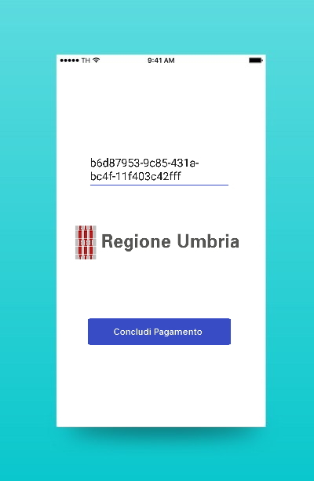

# PagoPA WISP Mobile SDK Hackathon

## Introduzione

Nell’ambito del progetto PagoPA, è stato rilasciato un SDK per dispositivi mobili che permette agli sviluppatori che lo vorranno, di realizzare applicazioni mobile per Android e iOS in grado di portare a termine un pagamento digitale avviato presso una Pubblica Amministrazione.

Nel processo di pagamento di un tributo tramite PagoPA, un cittadino può, tramite il portale web o una applicazione per smartphone della Pubblica Amministrazione, avviare il processo di pagamento che permette all’applicazione web e/o mobile della stessa di reindirizzare il cittadino su un apposito portale (Wizard Interattivo di Scelta del PSP - WISP) al fine di portare al termine il pagamento tramite uno dei metodi possibili (carta di credito, conto corrente, altri metodi di pagamento).

Oggetto di questa sfida è l'utilizzo dell'SDK mobile per integrare il Wizard Interattivo di Scelta del PSP all’interno delle applicazioni mobile, e concludere un pagamento.

## Obiettivo

2: S
1: 

Obiettivo di questo Hackathon sarà pertanto quello di realizzare un’applicazione mobile che, integrando lo SDK mobile di PagoPA e a partire di uno specifico ID Payment, permetta all’utilizzatore finale dell’applicazione di arrivare sul Wizard Interattivo di Scelta del PSP (WISP) per portare a termine il pagamento.

4: 
3: 

## Mobile SDK
Lo SDK rilasciato da AgID da utilizzare per questo Hackathon, assieme ad un esempio di applicazione funzionante, è disponibile su Github ai seguenti indirizzi:
https://github.com/italia/pagopa-android-example
https://github.com/italia/pagopa-ios-example

ID Payment E Conclusione Pagamento
Quando avrete necessità degli ID Payments per poter verificare il funzinamento della vostra applicazione, potrete richiederli tramite https://pagopa-test.bobuild.com/request

Lo SDK si interfaccia con un ambiente di test di PagoPA e quindi gli ID Payment forniti sono fittizi (IBAN, beneficiari, codici fiscali, date ecc non sono veritieri) e quindi i pagamenti non verranno completati per ovvie ragioni.
Ma arrivare alla schermata conclusiva del pagamento esula dall’obbiettivo di questa sessione.

Happy hacking!
